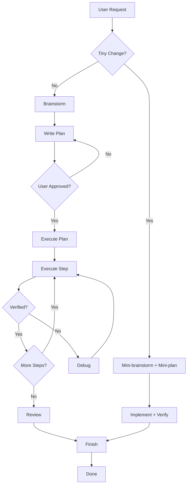

# 🚀 Superpowers Module Documentation

A comprehensive guide to the **Superpowers** agent configuration module, a disciplined framework for AI-assisted software development that enforces planning, verification, and safety at every step.

---

## 📖 Overview

The Superpowers module is an **agent configuration system** designed for Google Antigravity (formerly Gemini CLI). It implements a structured, disciplined approach to software development that prevents rushed implementations and ensures high-quality, verified code changes.

### Core Philosophy

> **"Plan before you code. Verify after you change. Never skip safety."**

The module enforces a **mandatory gate system** where:
- Non-trivial work requires **planning and approval** before implementation
- All changes must include **verification commands**
- Artifacts are **persisted to disk** for auditability
- Safety is built into every workflow

---

## 🏗️ Architecture

```
.agent/
├── rules/
│   └── superpowers.md           # Always-on rules enforced globally
├── skills/                       # Reusable capabilities
│   ├── superpowers-brainstorm/
│   ├── superpowers-debug/
│   ├── superpowers-finish/
│   ├── superpowers-plan/
│   ├── superpowers-python-automation/
│   ├── superpowers-rest-automation/
│   ├── superpowers-review/
│   ├── superpowers-tdd/
│   └── superpowers-workflow/
└── workflows/                    # Slash-command invoked procedures
    ├── superpowers-brainstorm.md
    ├── superpowers-debug.md
    ├── superpowers-execute-plan.md
    ├── superpowers-execute-plan-parallel.md
    ├── superpowers-finish.md
    ├── superpowers-reload.md
    ├── superpowers-review.md
    └── superpowers-write-plan.md
```

### Component Types

| Component | Purpose | How It's Used |
|-----------|---------|---------------|
| **Rules** | Always-on enforcement | Automatically applied to all work |
| **Skills** | Reusable knowledge/patterns | Referenced by workflows or directly |
| **Workflows** | Step-by-step procedures | Invoked via `/slash-commands` |

---

## 📋 Core Rules (Always-On)

The [superpowers.md](file:///c:/Users/adamd/Desktop/Learning/02Automation/custom-instruct/antigravity/superpowers/.agent/rules/superpowers.md) rules file defines enforcement that applies to **ALL work**:

### 1. Plan Gate for Non-Trivial Work
- **Never** edit code immediately for anything beyond tiny changes
- Must: Brainstorm → Write plan → Get approval → Then implement

### 2. Execute-Plan Gate
- After approval, do **NOT** auto-implement
- Must explicitly run `/superpowers-execute-plan`

### 3. Verification is Mandatory
- Every implementation must include exact verification commands
- Results must be documented

### 4. Prefer TDD / Regression Tests
- Bug fixes: Add regression tests
- New features: Add/adjust tests when practical

### 5. Review Pass Required
- Categorize issues by severity: **Blocker / Major / Minor / Nit**

### 6. Safety
- Never log secrets
- Add timeouts, retries, idempotency for API work
- Fail safe (no silent data loss)

### 7. Artifact Persistence
All brainstorms, plans, reviews, and finish outputs **must be written to disk** under:
```
artifacts/superpowers/
```

---

## 🎯 Workflows Reference

### `/superpowers-brainstorm`
**Purpose:** Structured ideation before implementation

**Output sections:**
- Goal
- Constraints  
- Known context
- Risks
- Options (2-4)
- Recommendation
- Acceptance criteria

**Artifact:** `artifacts/superpowers/brainstorm.md`

---

### `/superpowers-write-plan`
**Purpose:** Create step-by-step implementation plan

**Rules:**
- NO code editing allowed
- Steps must be small (2-10 minutes each)
- Each step needs verification commands

**Output format:**
```markdown
## Goal
## Assumptions
## Plan
1. Step name
   - Files: `path/to/file.ext`
   - Change: (1-2 bullets)
   - Verify: (exact commands)
## Risks & mitigations
## Rollback plan
```

**Artifact:** `artifacts/superpowers/plan.md`

**Approval:** User must reply **APPROVED** to proceed

---

### `/superpowers-execute-plan`
**Purpose:** Execute an approved plan step-by-step

**Preconditions:**
- Plan must be approved
- `artifacts/superpowers/plan.md` must exist

**Execution rules:**
1. Implement **ONE** step at a time
2. Run verification after each step
3. Append notes to `artifacts/superpowers/execution.md`
4. **Stop on failure** → Switch to debug skill

**Skills applied as needed:**
- `superpowers-tdd` (preferred)
- `superpowers-debug` (if issues)
- `superpowers-review`
- `superpowers-finish`

**Artifacts:**
- `artifacts/superpowers/execution.md` (per-step notes)
- `artifacts/superpowers/finish.md` (final summary)

---

### `/superpowers-execute-plan-parallel`
**Purpose:** Execute independent plan steps in parallel using subagents

**When to use:**
- Plan has 2+ independent steps
- Steps operate on different files
- You want faster execution

**When NOT to use:**
- Steps have dependencies
- All steps modify the same file
- Plan has < 2 steps

**Execution strategy:**
1. Analyze plan for independent steps
2. Group into batches
3. Spawn subagents in parallel per batch
4. Wait for batch completion
5. Verify all steps in batch
6. Proceed to next batch

**Example time savings:** 60% for a 5-step plan with 3 independent steps

---

### `/superpowers-debug`
**Purpose:** Systematic debugging workflow

**Debug steps (do not skip):**
1. **Reproduce** - Capture exact error, inputs, environment
2. **Minimize** - Reduce to smallest repro
3. **Hypotheses** - Rank 2-5 by likelihood
4. **Instrument** - Add logging/assertions
5. **Fix** - Smallest change for root cause
6. **Prevent** - Add regression test
7. **Verify** - Run failing case + suites

**Artifact:** `artifacts/superpowers/debug.md`

---

### `/superpowers-review`
**Purpose:** Quality review pass with severity levels

**Severity levels:**
| Level | Criteria |
|-------|----------|
| **Blocker** | Wrong behavior, security issue, data loss risk |
| **Major** | Likely bug, missing edge cases, poor reliability |
| **Minor** | Style, clarity, maintainability |
| **Nit** | Optional polish |

**Checklist:**
1. Correctness vs requirements
2. Edge cases & error handling
3. Tests (coverage, assertions)
4. Security (secrets, auth, injection)
5. Performance
6. Readability & maintainability
7. Docs/comments

**Artifact:** `artifacts/superpowers/review.md`

---

### `/superpowers-finish`
**Purpose:** Finalize and summarize work

**Output:**
- Verification (commands + results)
- Summary of changes
- Follow-ups (if any)
- Manual validation steps (if applicable)

**Artifact:** `artifacts/superpowers/finish.md`

---

### `/superpowers-reload`
**Purpose:** Reload configuration from disk

Reads and summarizes:
- `.agent/rules/`
- `.agent/workflows/`
- `.agent/skills/`

---

## 🛠️ Skills Reference

Skills are reusable knowledge modules that provide detailed guidance for specific tasks.

### superpowers-workflow
**The meta-skill** - Defines the default operating procedure.

**Default workflow:**
1. Brainstorm (clarify goal, constraints, risks)
2. Write plan (small steps with files + verification)
3. Implement (smallest correct change, tests-first)
4. Review pass (correctness, security, style)
5. Finish (verify, summarize, next steps)

**Decision tree:**
- **Tiny change:** Mini-brainstorm → mini-plan → implement → verify
- **Non-trivial:** Full brainstorm + plan first
- **High-risk:** Add rollback plan, dry-run, extra tests

---

### superpowers-plan
**When to use:**
- Multi-file changes
- Changes impacting behavior, data, auth, billing
- Systematic debugging

**Plan format:**
```markdown
### Goal
### Assumptions
### Plan
1. Step name
   - Files: `path/to/file.ext`
   - Change: (1-2 bullets)
   - Verify: (exact commands)
### Risks & mitigations
### Rollback plan
```

---

### superpowers-tdd
**Test-Driven Development discipline**

**Process:**
1. Define behavior change
2. Write/adjust test (make it fail first)
3. Implement minimal change to pass
4. Refactor (keep passing)
5. Run test suite + linters

**Output requirements:**
- What tests added/changed
- How to run them
- What they prove

---

### superpowers-brainstorm
**Structured ideation**

**Template:**
```markdown
### Goal
### Constraints
### Known context
### Risks
### Options (2-4)
  - Summary, Pros/cons, Complexity/risk
### Recommendation
### Acceptance criteria
```

---

### superpowers-debug
**Systematic debugging**

**Workflow:**
1. Reproduce → 2. Minimize → 3. Hypotheses → 4. Instrument → 5. Fix → 6. Prevent → 7. Verify

**Reporting format:**
- Symptom
- Repro steps
- Root cause
- Fix
- Regression protection
- Verification

---

### superpowers-review
**Quality review**

**Checklist:**
1. Correctness
2. Edge cases & error handling
3. Tests
4. Security
5. Performance
6. Readability
7. Documentation

---

### superpowers-finish
**Finalization**

**Checklist:**
- Run verification commands
- Confirm acceptance criteria met
- Summarize changes
- Call out risks/follow-ups
- Note rollback procedure

---

### superpowers-rest-automation
**REST API integration patterns**

**Design principles:**
- Idempotent by design
- Observable (logs/metrics)
- Fail safe
- Rate-limit aware
- Least privilege

**Key areas covered:**
- Authentication & secrets
- Idempotency & deduplication strategies
- Pagination & incremental sync
- Retries, backoff, timeouts
- Rate limits & quotas
- Data mapping & validation
- Error handling strategies
- Observability & audit trails
- Webhook handling
- Safety controls (dry-run, kill switch)

---

### superpowers-python-automation
**Python-specific REST API patterns**

**Preferred stack:**
- HTTP: `httpx` (or requests)
- Config: env vars + `.env` + pydantic-settings
- Logging: stdlib `logging`
- Testing: `pytest` + `respx`

**Reference architecture:**
```
client.py   - API client wrapper
models.py   - Typed payload models
sync.py     - Orchestration logic
main.py     - CLI entrypoint
tests/      - Unit tests
```

**HTTP rules:**
- Always set timeouts
- Centralize request sending
- Never log secrets

---

## 🔄 Typical Workflow



---

## 📁 Artifact Structure

All artifacts are persisted to disk for auditability:

```
artifacts/
└── superpowers/
    ├── brainstorm.md    # Ideation output
    ├── plan.md          # Approved implementation plan
    ├── execution.md     # Per-step execution notes
    ├── debug.md         # Debugging report
    ├── review.md        # Quality review output
    ├── finish.md        # Final summary
    └── subagents/       # Parallel execution logs
```

---

## 💡 Best Practices

### For Users

1. **Be specific** in your task descriptions
2. **Review plans carefully** before approving
3. **Use parallel execution** for independent steps
4. **Don't skip the debug workflow** when things fail

### For Extension

1. **Add new skills** for domain-specific patterns
2. **Keep steps small** (2-10 minutes each)
3. **Always include verification** in new workflows
4. **Persist artifacts** for all non-trivial outputs

---

## 🔗 Related Resources

- [Antigravity Documentation](https://ai.google.dev/gemini-api/docs/agentic)
- [Skills MD Format](https://docs.anthropic.com/en/docs/claude-code/memory#skills)
- [MCP (Model Context Protocol)](https://modelcontextprotocol.io/)

---

*This documentation was auto-generated from the Superpowers module analysis.*
